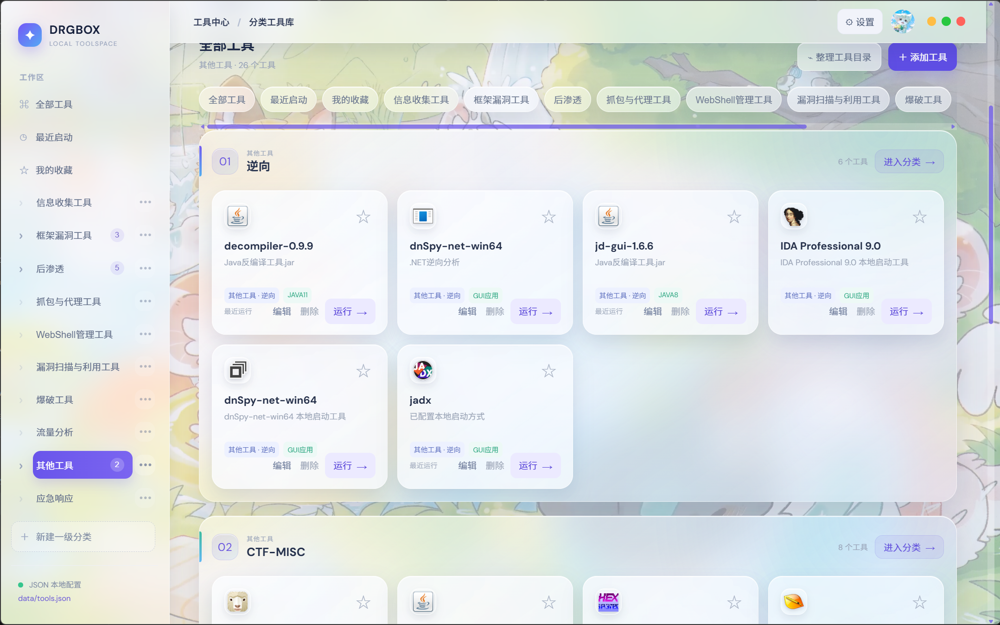

# DrgBox

DrgBox 是一个基于 **Go + Wails v2 + TypeScript** 的本地分类工具箱，用于整理和快速启动 GUI、命令行、脚本、PowerShell、Python、Java 8 与 Java 11 工具。项目可构建 Windows、Linux 和 macOS 发行包。

## 主要功能

- JSON 驱动的工具和分类配置
- 一级分类与二级分类
- 分类、二级分类和工具拖拽排序
- 将工具拖入其他分类
- 添加、编辑、删除工具及分类
- 搜索、收藏、最近启动
- EXE 系统图标自动提取与自定义图标
- GUI、命令行、批处理、PowerShell、Python、Java 8/11 启动
- Python、Java 8、Java 11 路径自定义
- 全局快捷键快捷分类栏
- 系统托盘常驻，关闭窗口后保持后台运行
- 浅色、深色、玻璃主题及亚克力透明度
- 图片和 MP4 动态壁纸、自定义头像

## 技术栈

- Go 1.23+
- Wails v2.12+
- TypeScript 4.5+
- Vite 3
- Windows WebView2 / Linux WebKitGTK / macOS WebKit

Windows 版功能最完整；Linux 与 macOS 版支持分类管理、托盘和常规工具启动。Windows 原生全局快捷键、EXE 图标提取及管理员启动在其他系统中不可用。

## 项目结构

```text
DrgBoxDesktop/
├─ app.go                       后端配置、分类、工具和启动逻辑
├─ main.go                      Wails 程序入口
├─ hotkey_windows.go            Windows 全局快捷键
├─ tray_windows.go              Windows 系统托盘
├─ icon_windows.go              Windows 图标提取和管理员启动
├─ launch_windows.go            Windows 工具启动逻辑
├─ platform_unix.go             Linux/macOS 工具启动兼容层
├─ tray_unix.go                 Linux/macOS 系统托盘
├─ .github/workflows/release.yml 多平台构建与 Release 发布
├─ frontend/
│  ├─ src/main.ts               主界面及交互逻辑
│  ├─ src/style.css             基础界面样式
│  ├─ src/category-menu.css     分类与拖拽样式
│  └─ src/launcher-enhancements.css
├─ installer/setup/             单文件安装器源码
├─ scripts/build.ps1            测试、构建及生成安装包
├─ data.example/                最小 JSON 配置示例
├─ vendor/                      Go 离线依赖
├─ go.mod
└─ wails.json
```

## 开发环境

1. 安装 Go 1.23 或更高版本。
2. 安装 Node.js 与 npm。
3. 安装 Wails CLI：

```powershell
go install github.com/wailsapp/wails/v2/cmd/wails@v2.12.0
```

4. 确保系统已安装 Microsoft Edge WebView2 Runtime。
5. 检查环境：

```powershell
wails doctor
```

## 数据目录

DrgBox 会从当前目录、程序目录及其上级目录中查找：

```text
data/tools.json
```

找到后，该目录的上一级将作为程序数据根目录。原始开发环境采用：

```text
D:\Car1N0tCat\data\tools.json
D:\Car1N0tCat\data\categories.json
D:\Car1N0tCat\data\settings.json
```

首次在其他目录开发时，可复制示例配置：

```powershell
Copy-Item -Recurse .\data.example .\data
```

### tools.json

```json
{
  "tools": [
    {
      "id": "example-tool",
      "name": "示例工具",
      "type": "GUI应用",
      "path": "D:\\Tools\\Example\\example.exe",
      "icon": "",
      "args": "",
      "category": "其他工具",
      "description": "示例本地工具",
      "tags": "示例,GUI",
      "source": "manual",
      "weight": 0,
      "favorite": false,
      "lastRun": 0
    }
  ]
}
```

支持的 `type`：

```text
GUI应用
命令行
批处理
PowerShell
Python
JAVA8
JAVA11
目录
```

二级分类使用 `一级分类/二级分类` 格式，例如：

```json
"category": "框架漏洞工具/Java框架"
```

### categories.json

```json
{
  "categories": [
    {
      "name": "框架漏洞工具",
      "children": ["Java框架", "PHP框架", "综合框架"]
    },
    {
      "name": "其他工具"
    }
  ]
}
```

### settings.json

```json
{
  "quickHotkey": "Ctrl+Alt+Space",
  "pythonPath": "",
  "java8Path": "",
  "java11Path": ""
}
```

运行环境路径留空时，程序先检查内置 `runtime`，再检查系统 `PATH`。也可以在界面右上角的“设置 → 运行环境”中配置。

## 开发运行

```powershell
cd DrgBoxDesktop
npm install --prefix frontend
wails dev
```

## 测试

```powershell
go test ./...
npm run build --prefix frontend
```

测试包含：

- 分类和二级分类配置
- 运行环境路径解析
- Windows 图标提取
- 中文、空格和连字符路径下的命令行启动

## 构建正式程序

```powershell
wails build
```

输出文件：

```text
build/bin/DrgBoxDesktop.exe
```

也可以运行完整构建脚本：

```powershell
powershell -ExecutionPolicy Bypass -File .\scripts\build.ps1
```

脚本会依次执行 Go 测试、前端构建、Wails 构建，并生成：

```text
build/bin/DrgBoxDesktop.exe
build/installer/DRGBOX-Setup.exe
```

## 多平台构建与 ZIP Release

Wails 桌面程序依赖各系统的原生 WebView。推荐让 GitHub Actions 分别在 Windows、Ubuntu 和 macOS Runner 上构建，而不是在 Windows 上强行交叉编译。

项目已包含 `.github/workflows/release.yml`，推送 `v` 开头的标签后会自动：

1. 在 Windows 构建 `windows-amd64`；
2. 在 Ubuntu 构建 `linux-amd64`；
3. 在 macOS 构建 Intel/Apple Silicon 通用版；
4. 分别生成 ZIP；
5. 创建 GitHub Release 并上传全部 ZIP。

发布新版本：

```powershell
git add .
git commit -m "Release v0.1.0"
git push
git tag v0.1.0
git push origin v0.1.0
```

随后打开仓库的 **Actions → Build and Release** 查看进度，完成后在 **Releases** 页面下载：

```text
DrgBox-v0.1.0-windows-amd64.zip
DrgBox-v0.1.0-linux-amd64.zip
DrgBox-v0.1.0-macos-universal.zip
```

也可以在 Actions 页面手动运行工作流，并填写新的版本标签。若发布阶段提示权限不足，请在仓库 **Settings → Actions → General → Workflow permissions** 中选择 **Read and write permissions**。

### 本机构建命令

Windows：

```powershell
wails build -platform windows/amd64 -clean
```

Linux（需要 GTK3、WebKitGTK 4.1 和 AppIndicator 开发包）：

```bash
wails build -platform linux/amd64 -clean -tags webkit2_41
```

macOS：

```bash
wails build -platform darwin/universal -clean
```

每个 ZIP 都会附带 `README.md` 和由 `data.example` 生成的初始 `data` 目录。不同系统的工具路径不通用，需要在对应系统中重新指定工具和运行环境路径。

## 安装位置

当前安装器默认安装到：

```text
D:\Car1N0tCat\DRGBOX\DRGBOX.exe
```

如需修改安装目录，请调整：

```text
installer/setup/main.go
```

## 运行环境默认位置

未在设置中指定路径时，程序优先检查：

```text
runtime/python3/python.exe
runtime/Java_path/Java_8_win/bin/javaw.exe
runtime/Java_path/Java_11_win/bin/javaw.exe
```

随后回退到系统 `PATH` 中的 `python.exe`、`javaw.exe` 或 `java.exe`。

## 注意事项

- 工具配置中的路径必须指向本机存在的文件或目录。
- 删除工具只会从 `tools.json` 移除，不会删除磁盘文件。
- 删除分类会重新归类其中的工具，不会删除工具文件。
- 命令行和批处理工具会保留终端窗口，便于查看输出。
- 用户工具、壁纸、头像、图标缓存和运行环境不包含在源码压缩包中。
